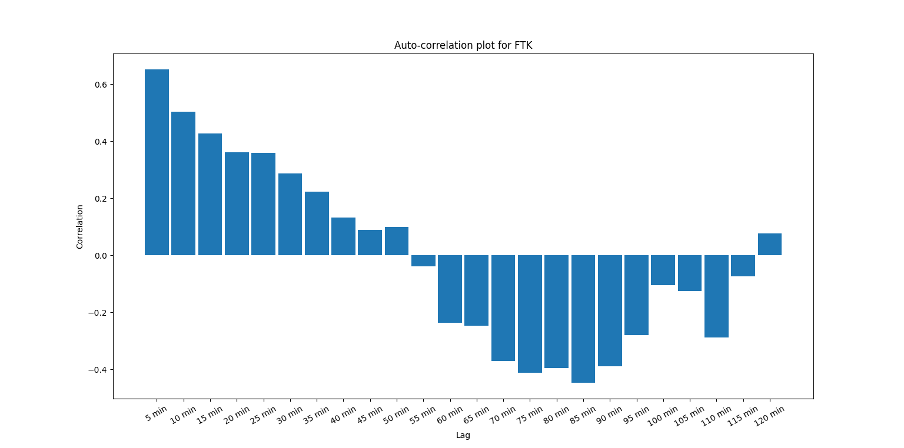
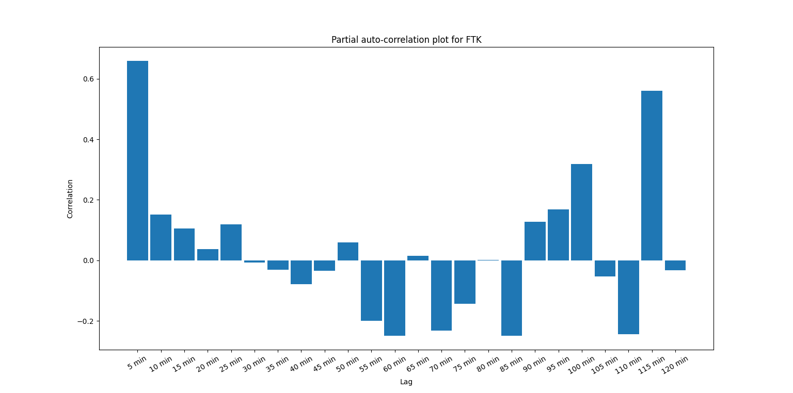
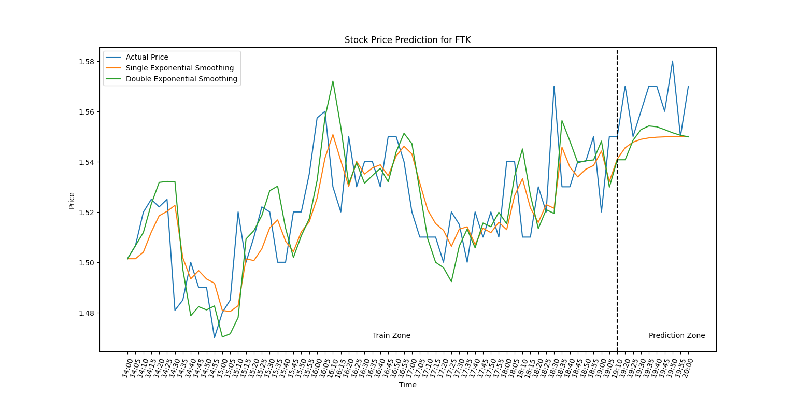

# Stock Selection & Time Series Analysis
This project scrapes Twitter and Reddit data for a pre-defined
time window and searches for stock mentions. 
A dictionary of the hottest tickers will be returned. 
The user can then select one of these tickers and scrape the 
historical stock data. A time series analysis is performed
for a pre-defined time window and auto-correlation, partial auto-correlation, 
simple exponential smoothing and double exponential smoothing 
are calculated and the prediction performance is being assessed. 

## Setup
Set up a file called *local_config.py* in the configurations
directory that has the following structure:

```
import os


class LocalConfig:

    # CPU count
    NUM_CPUS = os.cpu_count() - 2

    # Reddit credentials
    REDDIT_CLIENT_ID = 'XXX'
    REDDIT_CLIENT_SECRET = 'XXX'
    REDDIT_USERNAME = 'XXX'
    REDDIT_PASSWORD = 'XXX'
    REDDIT_USER_AGENT = 'XXX'

    # Twitter credentials
    TWITTER_CONSUMER_KEY = 'XXX'
    TWITTER_CONSUMER_SECRET = 'XXX'
    TWITTER_ACCESS_TOKEN = 'XXX'
    TWITTER_ACCESS_TOKEN_SECRET = 'XXX'

    # Stock Pulling API
    ALPHA_VANTAGE_API_KEY_EXTENDED_HISTORY = 'XXX'

    # postgreSQL database credentials
    DB_NAME = 'XXX'
    USER = 'XXX'
    PW = 'XXX'
    HOST = 'XXX'
    PORT = 'XXX'
```

A Reddit account as well as a Twitter account are needed
so that the required credentials can be generated. 

An Alpha Vantage account to scrape historical stock data is required as
well.

Further, the user has to install postgres and create a table 
with the following command: 
"CREATE TABLE stock_selection_db (id SERIAL PRIMARY KEY, ticker VARCHAR(5), rmse float);"

## Reddit and Twitter Scraping
In the *execution_files* directory is a file called 
*execution_parameters_stock_picking*. Those parameters have to be set
manually by the user. After that the *main* function in the file
*main_stock_picking* can be executed. The multithreading option is 
recommended if lots of data are being scraped to speed up the process.

## Stock Data Scraping and Prediction
In the *execution_files* directory is a file called 
*execution_parameters_stock_prediction*. Those parameters have to be set
manually by the user. Ideally, a ticker should be specified
that was detected to occur several times in the Reddit 
and Twitter social media posts that were analyzed in the previous 
step. After that the *main* function in the file
*main_stock_prediction* can be executed.
The results will be stored in a folder called 
*results* which will be 
created during runtime. 
Further, the prediction rmse ist stored in the database
if the user selected the option *store_in_db = True*.
Example outputs can be viewed in the *examples* folder and may look like this:


Auto-Correlation Example             |  Partial Auto-Correlation Example
:-------------------------:|:-------------------------:
  |  




